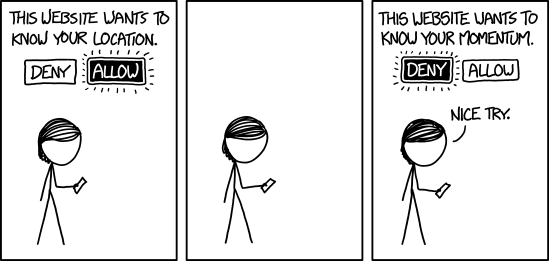

# About the project
## How it's working?
1, It gets your location

2, It shows you a swiper with stuffs for sale, where the first one is the closest one in your area

3, You can bid on one stuff, or you can buy it immediately, communication is possible through comments and private messages

4, If you want to sell a stuff, you just take pictures, add a description to it, and tadaam.. your stuff is posted!

## Which technologies we used?

### Frontend side

++Apache Cordova++ is a platform for building native mobile applications using HTML, CSS and JavaScript.

++Onsen UI++ is a Javascript and CSS framework for developing awesome looking and high performance HTML5 mobile apps. It provides ++AngularJS++ and ++jQuery++ bindings.

### Backend side

++Django REST++ framework makes it easy to build Web APIs and provides powerful model serialization.

Development environment: ++Docker++ - an open platform for building, shipping and running distributed applications.

Test driven development: we used ++py-test++ to test everything working fine.